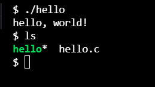
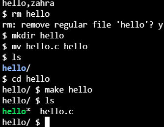

// make hello or make hello.c => That's going to translate your source code into ones and zeroes.
// make represents the compiler, so to speak, the program that converts source code to machine code.

// code hello.c
// make hello
// ./hello

https://manual.cs50.io/

